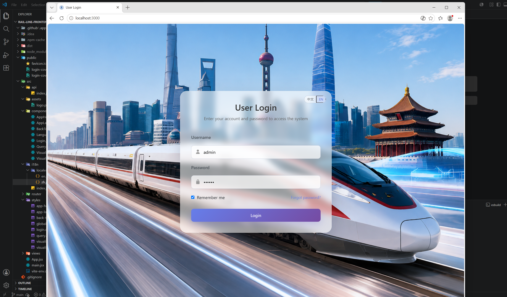
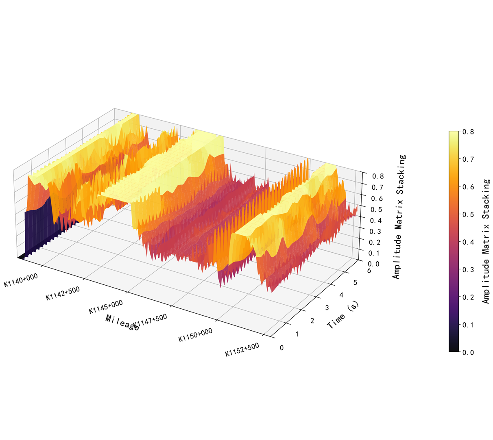
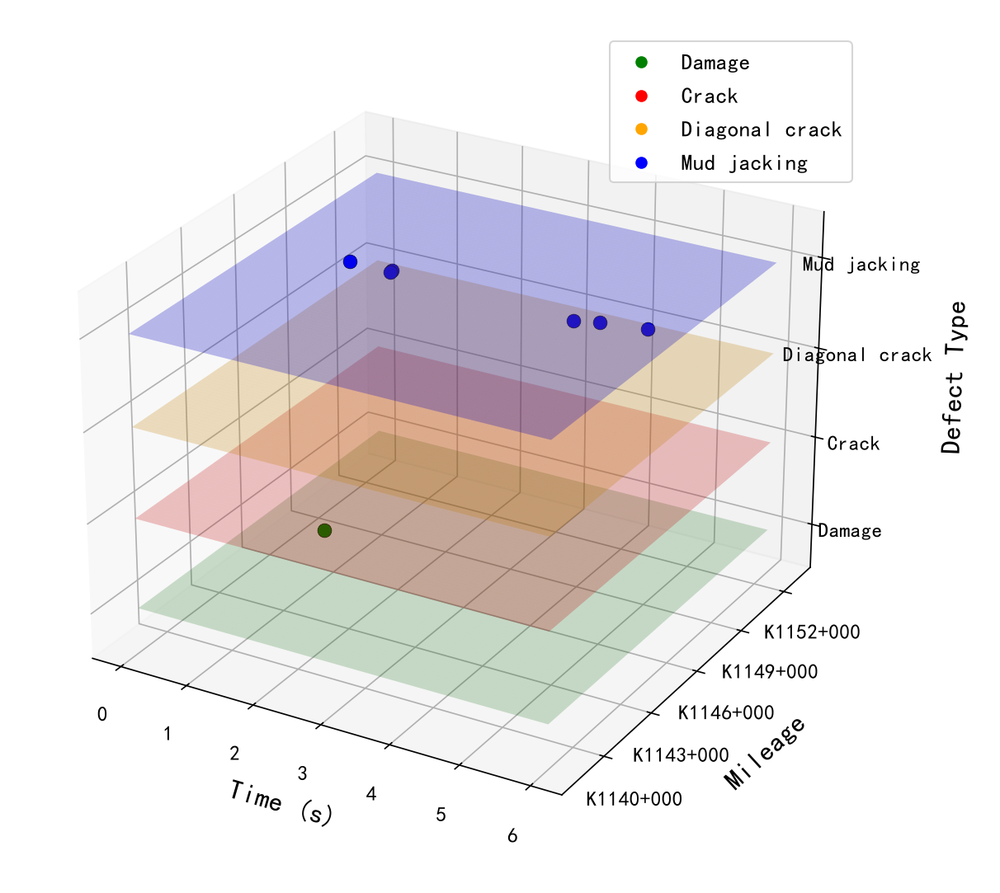
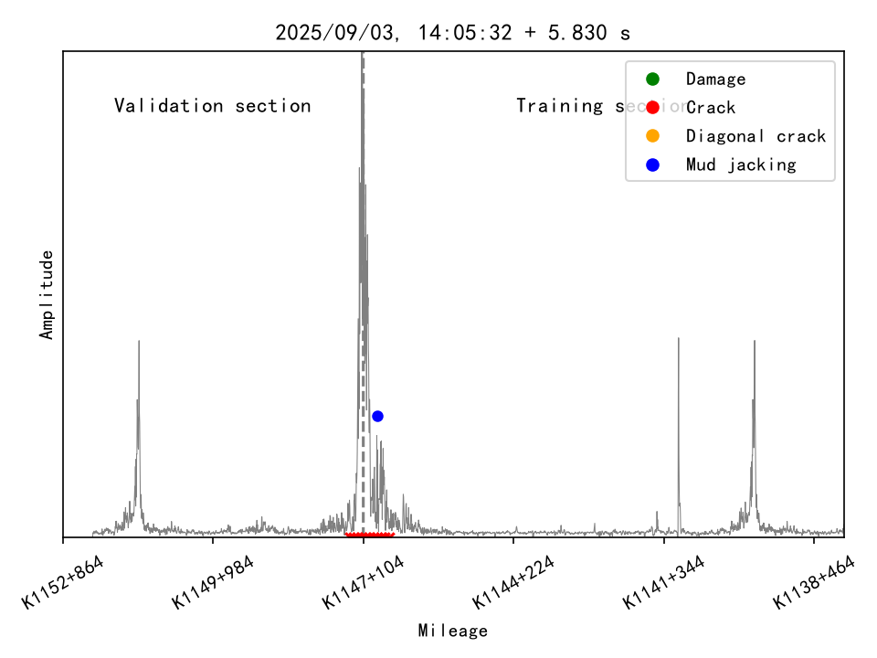

# High-Speed Rail Defect Detection System

A full-stack web system for high-speed railway defect detection, inspection record management, and 2D/3D visualization. The project combines a React frontend, a Spring Boot backend, MySQL data storage, Excel export, and Python-based visualization scripts into one portfolio-friendly repository.



## Project Highlights

- Full-stack project structure with separate `frontend/` and `backend/` modules.
- Defect query workflow based on railway line, mileage range, inspection date, severity, and defect type.
- Side-by-side comparison between detection results and maintenance ledger records.
- Detail modal for defect history, suggestions, and inspection metadata.
- Excel export for detection results, ledger records, and combined datasets.
- 2D/3D visualization workflow with generated analysis images and downloadable results.
- Environment-variable-based backend configuration to avoid committing local passwords, script paths, or secrets.

## Repository Structure

```text
High-Speed-Rail-Defect-System/
|-- backend/              # Spring Boot backend service
|-- frontend/             # React + Vite frontend application
|-- python-analysis/      # Python DAS analysis and visualization scripts
|-- database/             # MySQL schema and demo seed data
|-- docs/                 # Architecture notes, API docs, and screenshots
|-- deploy/               # Local dependency setup
`-- README.md             # Project overview and setup guide
```

## Tech Stack

| Layer | Technologies |
| --- | --- |
| Frontend | React, Vite, Axios, React Router, i18next, Bootstrap |
| Backend | Java 17, Spring Boot, Spring Security, Spring Data JPA, JWT |
| Database | MySQL |
| Visualization | Python scripts for 2D/3D defect analysis outputs |
| Export | Apache POI |

## Features

- User login and JWT-based authentication
- Railway line and defect type metadata APIs
- Defect detection result query, filtering, sorting, and pagination
- Maintenance ledger query, filtering, sorting, and pagination
- Defect detail view with history and maintenance suggestion
- Excel export for detection, ledger, and combined data
- 2D visualization generation and result display
- 3D scatter and amplitude visualization generation, display, and download
- Chinese/English UI language support


## Backend Configuration

The backend configuration is stored in `backend/src/main/resources/application.yml` and supports environment variables.

Common variables:

| Variable | Description |
| --- | --- |
| `SERVER_PORT` | Backend service port |
| `DB_URL` | MySQL JDBC URL |
| `DB_USERNAME` | MySQL username |
| `DB_PASSWORD` | MySQL password |
| `JWT_SECRET` | JWT signing secret |
| `PYTHON_EXE` | Python executable path |
| `ANALYZE_SCRIPT` | NPY analysis script path |
| `VIZ_SCRIPT_2D` | 2D visualization script path |
| `VIZ_SCRIPT_3D` | 3D visualization script path |
| `VIZ_SCRIPT_3D_AMP` | 3D amplitude visualization script path |

## Frontend Configuration

The frontend reads the backend API base URL from a Vite environment variable:

```env
VITE_API_BASE=http://localhost:8080/api
```

For local development, create `frontend/.env.local` if the backend runs on a different host or port. A sample file is provided at [frontend/.env.example](frontend/.env.example).

## Documentation

- [System Architecture](docs/architecture.md)
- [API Reference](docs/api.md)
- [Python Analysis Scripts](python-analysis/README.md)
- [Database Setup](database/README.md)
- [Backend Guide](backend/README.md)
- [Frontend Guide](frontend/README.md)

## My Role

The defect detection logic and DAS-based analysis scripts were derived from doctoral research work at Beijing Jiaotong University. Based on these research outputs, I developed a full-stack web system to make the detection results queryable, visualizable, and easier to demonstrate.

My responsibilities included structuring the repository, building the React frontend, connecting Spring Boot APIs, integrating Python-based 2D/3D visualization scripts, configuring the query and export workflows, and presenting railway defect detection results through an interactive web interface.

## Known Limitations

- The visualization scripts and raw railway inspection datasets are environment-dependent and may require local path configuration before running end to end.
- The repository includes configuration examples, but production deployment should provide real database credentials and a strong `JWT_SECRET` through environment variables.
- Demo database schema and seed data are included for portfolio review, but production data and raw DAS datasets are intentionally excluded.
- Model checkpoints, raw DAS datasets, generated `.npy` files, and runtime output directories are intentionally excluded from Git because of file size and data privacy constraints.
- The frontend build currently produces a large JavaScript bundle; code splitting can be added later to improve production loading performance.

## Screenshots

| 3D Amplitude | 3D Scatter |
| --- | --- |
|   |  |

| Defect Validation |
| --- |
| |

## Portfolio Summary

This project demonstrates full-stack engineering ability across frontend UI development, backend API design, authentication, data querying, export workflows, and visualization integration.

Suggested resume entry:

```text
High-Speed Rail Defect Detection System
Full-stack web system built with React, Spring Boot, MySQL, JWT authentication, Excel export, and Python-based 2D/3D visualization.
https://github.com/KFgituser/High-Speed-Rail-Defect-System
```
