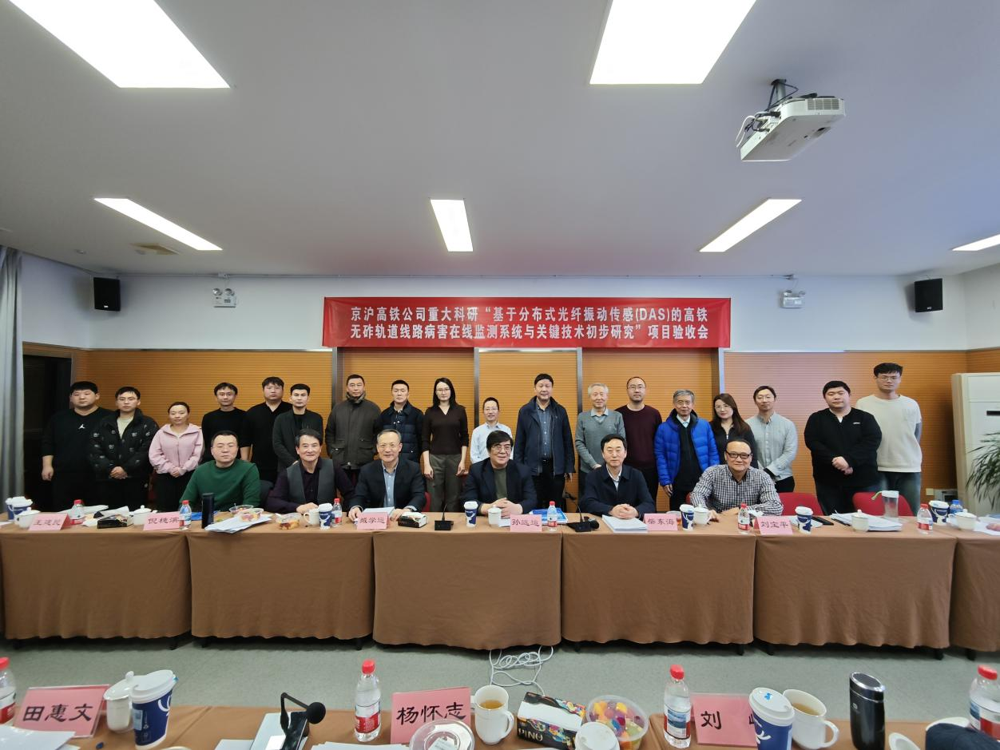
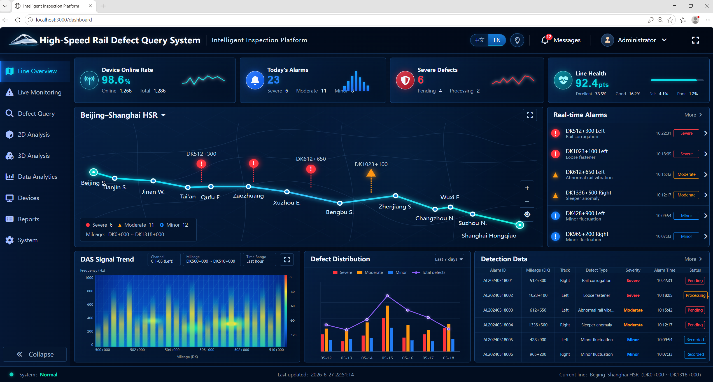
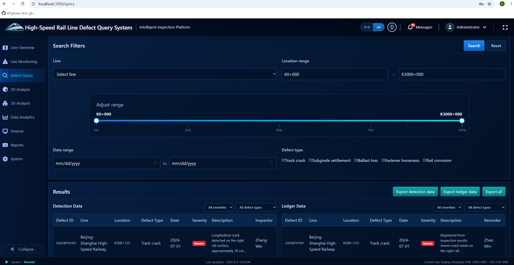
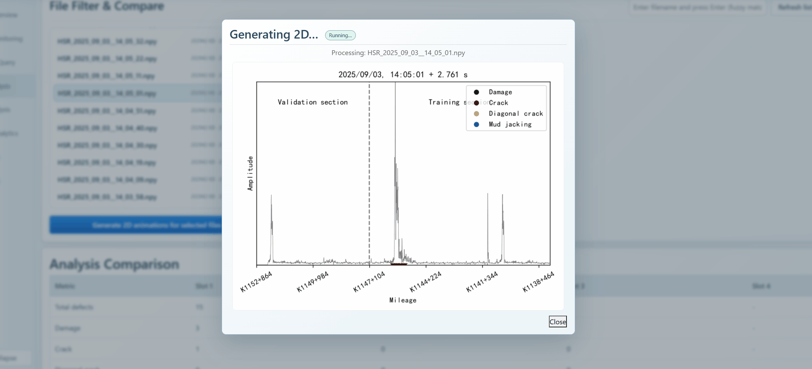

# High-Speed Rail Defect Detection System

Distributed Acoustic Sensing (DAS) is a technology that uses existing or dedicated optical fibers to detect vibrations along a route. It turns long-distance fiber into a continuous array of sensors capable of capturing train operations, track-structure changes, abnormal vibrations, and potential defects. Designed for high-speed railway applications, this project integrates DAS inspection data, defect queries, ledger management, and 2D/3D visualization into a demonstrable full-stack system, making inspection results easier to search, analyze, and present. The project combines a React frontend, a Spring Boot backend, MySQL data storage, Excel export, and Python-based visualization scripts into one portfolio-friendly repository.


## DAS Project Results

The DAS project has completed preliminary acceptance. Participating experts and scholars unanimously recognized the project's phased achievements, agreed that it had passed preliminary acceptance, and awarded it a score of 94.


Acceptance Review Meeting for the Beijing–Shanghai High-Speed Railway Co., Ltd. Major Research Project: “Preliminary Research on an Online Monitoring System and Key Technologies for High-Speed Railway Ballastless Track Defects Based on Distributed Acoustic Sensing (DAS)”



## My Role

The defect detection logic and DAS-based analysis scripts were derived from doctoral research work at Beijing Jiaotong University. Based on these research outputs, I developed a full-stack web system to make the detection results queryable, visualizable, and easier to demonstrate.

My responsibilities included structuring the repository, building the React frontend, connecting Spring Boot APIs, integrating Python-based 2D/3D visualization scripts, configuring the query and export workflows, and presenting railway defect detection results through an interactive web interface.

## Project Highlights

- Full-stack project structure with separate `frontend/` and `backend/` modules.
- Defect query workflow based on railway line, numeric mileage range, inspection date, severity, and multiple defect types.
- Side-by-side comparison between detection results and maintenance ledger records.
- Detail modal for defect history, suggestions, and inspection metadata.
- Filtered Excel export for detection results, ledger records, and combined datasets.
- 2D/3D visualization workflow with generated analysis images and downloadable results.
- Environment-variable-based backend configuration to avoid committing local passwords, script paths, or secrets.

## Repository Structure

```text
High-Speed-Rail-Defect-System/
|-- .github/
|   `-- workflows/ci.yml          # GitHub Actions test, package, and build workflow
|-- backend/                      # Spring Boot backend service
|   |-- Dockerfile                # Backend container image definition
|   |-- pom.xml                   # Maven dependencies and package configuration
|   `-- src/test/                 # JUnit tests and H2 test configuration
|-- frontend/                     # React + Vite frontend application
|   |-- Dockerfile                # Frontend container image definition
|   |-- package.json              # npm scripts and frontend dependencies
|   `-- src/
|       |-- api/index.test.js     # API client tests
|       |-- components/LanguageToggle.test.jsx
|       `-- test/setup.js         # Vitest setup
|-- python-analysis/              # Python DAS analysis and visualization scripts
|-- database/                     # MySQL schema and demo seed data
|-- docs/                         # Architecture notes, API docs, and screenshots
|-- deploy/
|   `-- docker-compose.yml        # Local Docker Compose stack
`-- README.md                     # Project overview and setup guide
```

## Tech Stack

| Layer | Technologies |
| --- | --- |
| Frontend | React, Vite, Axios, React Router, i18next, Bootstrap |
| Backend | Java 17, Spring Boot, Spring Security, Spring Data JPA, JWT |
| Database | MySQL |
| Visualization | Python scripts for 2D/3D defect analysis outputs |
| Export | Apache POI |

## Features

- User login and JWT-based authentication
- Railway line and defect type metadata APIs
- Defect detection result query with server-side filtering and pagination
- Maintenance ledger query with server-side filtering and pagination
- Defect detail view with history and maintenance suggestion
- Excel export for detection, ledger, and combined data
- 2D visualization generation and result display
- 3D scatter and amplitude visualization generation, display, and download
- Chinese/English UI language support


## Backend Configuration

The backend configuration is stored in `backend/src/main/resources/application.yml` and supports environment variables.

Common variables:

| Variable | Description |
| --- | --- |
| `SERVER_PORT` | Backend service port |
| `DB_URL` | MySQL JDBC URL |
| `DB_USERNAME` | MySQL username |
| `DB_PASSWORD` | MySQL password |
| `APP_JWT_SECRET` | JWT signing secret (at least 32 characters) |
| `INIT_ADMIN_USERNAME` / `INIT_ADMIN_PASSWORD` | Initial administrator credentials when enabled |
| `PYTHON_EXE` | Python executable path |
| `JH_CODEBASE_DIR` | Directory containing visualization scripts and output |
| `NPY_DIR` | Directory containing DAS `.npy` data |

## Frontend Configuration

The frontend uses `/api` by default; Vite and Nginx proxy that path to the backend. To override it, set:

```env
VITE_API_BASE=http://localhost:8080/api
```

For local development, create `frontend/.env.local` if the backend runs on a different host or port. A sample file is provided at [frontend/.env.example](frontend/.env.example).

## Docker Configuration

Docker support is provided for local portfolio review and environment setup.

- `frontend/Dockerfile` builds the React/Vite app with Node and serves the production bundle through Nginx.
- `frontend/nginx/default.conf` proxies `/api/` and visualization output paths to the backend service.
- `backend/Dockerfile` builds the Spring Boot service with Maven, then runs it on a Java 17 runtime image.
- `backend/requirements-docker.txt` installs the Python packages needed by the visualization scripts inside the backend container.
- `deploy/docker-compose.yml` starts MySQL, the backend API, and the frontend web server together.
- `deploy/.env.example` documents the local environment variables used by Docker Compose.

To run the stack with Docker:

```bash
cd deploy
copy .env.example .env
# Edit .env and set database, JWT, and initial administrator passwords.
docker compose up --build
```

The frontend is exposed at:

```text
http://localhost:3000
```

The backend API is exposed at:

```text
http://localhost:8080/api
```

The compose file keeps database data in a Docker volume. It mounts the script and NPY directories from the host. Set `JH_CODEBASE_HOST_DIR` and `NPY_HOST_DIR` in `deploy/.env` to use the full visualization workflow; the included public scripts and demo records are enough to explore the query and export screens. The original DAS datasets and algorithm environment are not part of this repository. Credentials belong in `deploy/.env`, which is ignored by Git.

## Documentation

- [System Architecture](docs/architecture.md)
- [API Reference](docs/api.md)
- [Python Analysis Scripts](python-analysis/README.md)
- [Database Setup](database/README.md)
- [Backend Guide](backend/README.md)
- [Frontend Guide](frontend/README.md)

## Known Limitations

- The visualization scripts and raw railway inspection datasets are environment-dependent and may require local path configuration before running end to end.
- The repository includes configuration examples, but deployment requires database credentials, an initial administrator password, and a strong `APP_JWT_SECRET` through environment variables.
- Demo database schema and seed data are included for portfolio review, but production data and raw DAS datasets are intentionally excluded.
- Model checkpoints, raw DAS datasets, generated `.npy` files, and runtime output directories are intentionally excluded from Git because of file size and data privacy constraints.
- The frontend build currently produces a large JavaScript bundle; code splitting can be added later to improve production loading performance.

## Screenshots

| 3D Amplitude | 3D Scatter |
| --- | --- |
|  |  |

| Defect Validation |
| --- |
|  |

| Dashboard Home |
| --- |
|  |

| Defect Query |
| --- |
|  |

## Defect Validation Animation



## Portfolio Summary

This project demonstrates full-stack engineering ability across frontend UI development, backend API design, authentication, data querying, export workflows, and visualization integration.

Suggested resume entry:

```text
High-Speed Rail Defect Detection System
Full-stack web system built with React, Spring Boot, MySQL, JWT authentication, Excel export, and Python-based 2D/3D visualization.
https://github.com/KFgituser/High-Speed-Rail-Defect-System
```
