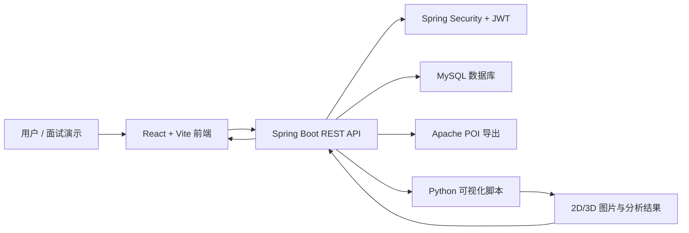

# 系统架构

## 分层说明

| 层级 | 职责 |
| --- | --- |
| 前端 | 登录、筛选查询、结果表格、详情弹窗、导出、可视化结果展示 |
| 后端控制器 | 对外提供 REST API，处理认证、查询、导出和可视化任务 |
| 服务层 | 封装业务逻辑、任务状态、数据转换和 Python 脚本调用 |
| 数据层 | 使用 Spring Data JPA 访问 MySQL |
| 可视化脚本 | 读取 NPY/业务数据并生成 2D/3D 结果图片 |

## 数据流

1. 用户在前端选择线路、里程、日期和病害类型。
2. 前端请求后端查询接口，后端从 MySQL 读取检测结果和台账。
3. 用户触发导出时，后端使用 Apache POI 生成 Excel 文件。
4. 用户触发可视化时，后端调用 Python 脚本生成图片结果。
5. 前端轮询或监听任务状态，最终展示并支持下载可视化结果。
