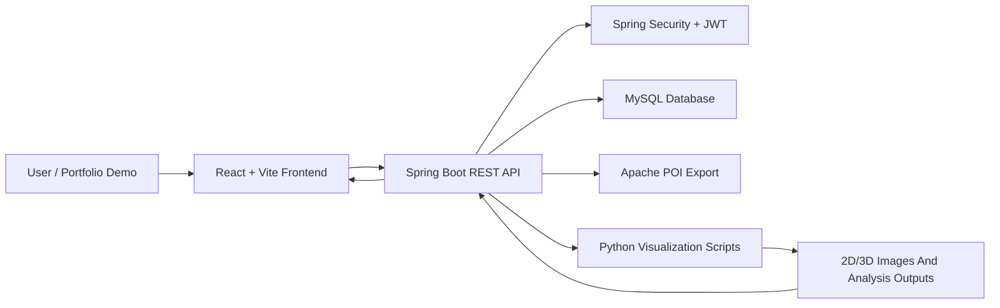

# System Architecture

## Layers

| Layer | Responsibility |
| --- | --- |
| Frontend | Login, query filters, result tables, detail modal, export actions, and visualization pages. |
| Backend Controllers | Provide REST APIs for authentication, data queries, export, and visualization tasks. |
| Service Layer | Handles business logic, task status management, data transformation, and Python script invocation. |
| Data Layer | Uses Spring Data JPA to access MySQL data. |
| Visualization Scripts | Read NPY or business data and generate 2D/3D analysis images. |

## Data Flow

1. The user selects a railway line, mileage range, date range, and defect type in the frontend.
2. The frontend sends query requests to the Spring Boot backend.
3. The backend reads detection results and maintenance ledger records from MySQL.
4. When the user exports data, the backend uses Apache POI to generate Excel files.
5. When the user starts visualization, the backend calls Python scripts to generate image outputs.
6. The frontend polls or streams task status and displays the final visualization results.

## Runtime Components

| Component | Role |
| --- | --- |
| React frontend | User-facing web application. |
| Spring Boot backend | API layer and business logic host. |
| MySQL | Stores railway lines, defect types, detection data, users, and ledger records. |
| Python scripts | Produce 2D/3D defect analysis artifacts. |
| File output directories | Store generated screenshots, thumbnails, plots, and runtime visualization results. |
